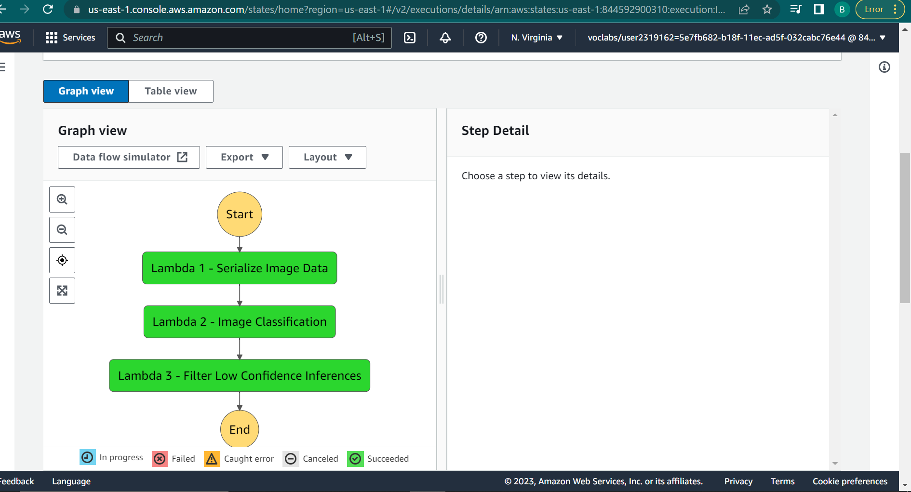
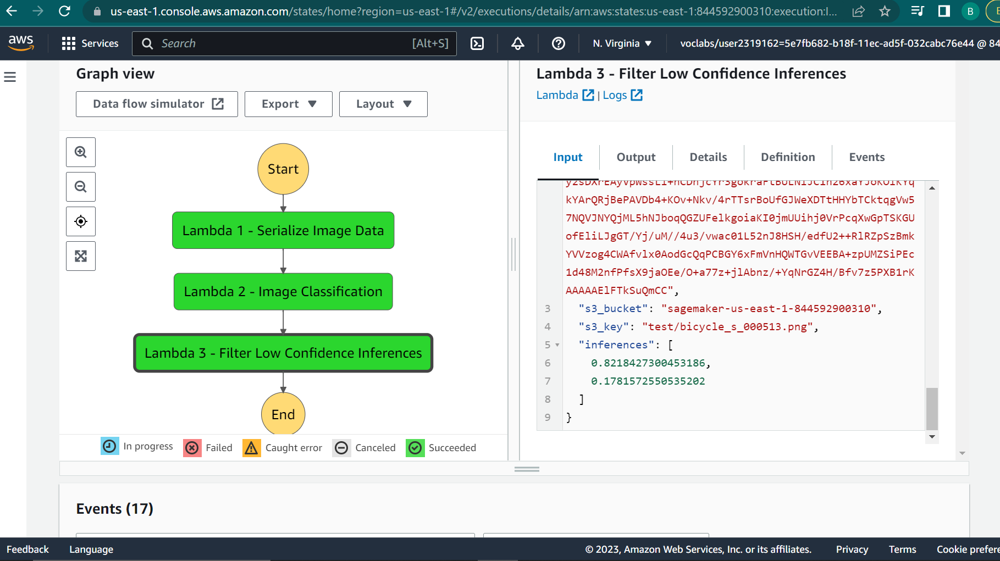

# Udacity-AWS-MLE-ND-Project2-Build-a-ML-Workflow-For-Scones-Unlimited-On-Amazon-SageMaker
The primary objective of this project was to build and deploy an image classification model for Scones Unlimited, a scone-delivery-focused logistic company, using AWS SageMaker.

# Project: 
## Deploy and Monitor a Machine Learning Workflow for Image Classification Using Amazon SageMaker
### Source: AWS Machine Learning Engineer Nanodegree Scholarship Program

## 1. Overview

This project was a part of the project assessment in the **'AWS x Udacity's Machine Learning Engineer Nanodegree Scholarship Program'**.

## 2. Getting Started

### 2.1. Project files related information:

**1. `Project2_Build-a-ML-Workflow-For-Scones-Unlimited-On-Amazon-SageMaker.ipynb`:** Jupyter notebook showcases a machine learning working workflow for Image Classification. This includes the necessary preprocessing of the scones unlimited image dataser, model training, deployment and monitor using Amazon SageMaker and other associated AWS Services.<br><br>
**2. `Project2_Build-a-ML-Workflow-For-Scones-Unlimited-On-Amazon-SageMaker.html`:** Web-page displaying 'Project2_Build-a-ML-Workflow-For-Scones-Unlimited-On-Amazon-SageMaker.ipynb'<br><br>
**3. `Lambda.py` script:** `compilation of the necessary 'lambda.py' scripts used by three AWS Lambda functions to create a Step Functions workflow`. (*Note: The 'lambda.py' file typically has a 'lambda_handler' function, which acts as the entry point for the Lambda function when it is triggered by an event such as an HTTP request or a scheduled cron job. This function takes an 'event' object, which contains information about the triggering event and a 'context' object, which contains information about the current execution environment. The 'lambda_handler' function is where the main logic of the Lambda function is executed, it can interact with other AWS services, perform calculations or process data. The function can also return a response to the service or client that triggered the Lambda function.)*<br><br>
**4. `Screenshot-of-Working-Step-Function.PNG`:** screen capture of working step function. <br><br>
**5. `step-function.json`:** Step Function exported to JSON<br><br>

### 2.2. Dependencies
```
Python 3 (Data Science) - v3.7.10 kernel
ml.t3.medium instance
Python 3.8 runtime for the AWS Lambda Functions
```

### 2.3. Installation

For local development, you will need to setup a jupyter lab instance.
* Follow the [jupyter install](https://jupyter.org/install.html) link for best practices to install and start a jupyter lab instance.
* If you have a python virtual environment already installed you can just `pip` install it.
```
pip install jupyterlab
```
* There are also docker containers containing jupyter lab from [Jupyter Docker Stacks](https://jupyter-docker-stacks.readthedocs.io/en/latest/index.html).

## 3. Approach:

The project aims to develop an image classification Machine Learning Model using workflows on Amazon SageMaker, automating various Machine Learning tasks such as Data Preparation, Model Training, Deployment, and Inference with the help of AWS Step Functions and Lambda functions.

### 3.1. Individual AWS Lambda functions drafted to build an AWS Step Functions Workflow:<br>

1. The `serializeImageData` Lambda Function ([zipped `lambda_function.py` script](https://github.com/brian-kipkoech-tanui/sagemaker-ML-workflow/blob/master/Lambda%20functions%20python%20scripts/Lambda-1-serializeImageData-code.zip)) takes the address of an image hosted in S3, and returns a serialized JSON object.<br>
2. The `Image-Classification` Lambda Function ([zipped `lambda_function.py` script](https://github.com/brian-kipkoech-tanui/sagemaker-ML-workflow/blob/master/Lambda%20functions%20python%20scripts/Lambda-2-Image-Classification-code.zip)) accepts the JSON object obtained from step 1 and sends it to an endpoint, collecting inferences as a JSON object.<br>
3. The `Filter Low Confidence Inferences` Lambda Function ([zipped `lambda_function.py` script](https://github.com/brian-kipkoech-tanui/sagemaker-ML-workflow/blob/master/Lambda%20functions%20python%20scripts/Lambda-3-Filter-Low-Confidence-Inferences-code.zip)) takes the inference data from step 2, and filters only the images that meet the pre-defined threshold.<br>

### 3.2. Building a State Machine via AWS Step Functions

#### 3.2.1. Execution Flow of the Step Function 


#### 3.2.2. Step Function Graph



#### 3.2.3. Step Function Output



## License

[License](LICENSE)

<br>

Thank you for taking the time to visit this repository!
